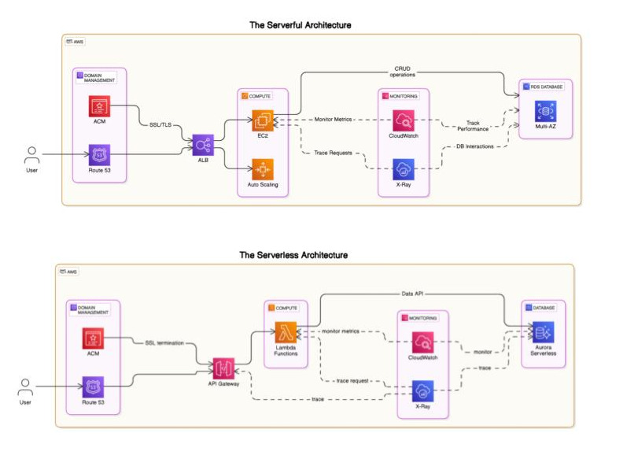

# Evaluating Serverful and Serverless Cloud Architecture on AWS: A Comprehensive Analysis

As cloud computing continues to evolve, organizations face a critical decision between adopting serverful (traditional) or serverless architectures. While both paradigms promise scalability, cost efficiency, and performance optimization, the challenge lies in understanding which solution best aligns with specific use cases and workloads.

In this project, I designed and deployed a FlaskAPI project on AWS to directly compare serverful and serverless models using identical requirements and workloads. This hands-on exploration provided me with invaluable insights into the real-world performance and cost implications of both architectures.

Additionally, I authored an in-depth thesis titled "Evaluating the Cost Dynamics of Serverless and Serverful Cloud Solutions: A Comparative Analysis." On this research, I conducted a comprehensive analysis of the cost dynamics and performance trade-offs between serverless and traditional serverful models. The research have given me a nuanced understanding of cloud cost dynamics and a decision framework was developed based on the findings.

This project, paired with my academic research, has honed my ability to make informed decisions regarding cloud service selection and architecture design—key skills for building scalable, cost-efficient, and high-performing cloud-based solutions.

## Checkout the following attachments:

- ### [ The Brief Documentation](./assets/Brief_Documentation.pdf)
- ### [ The Thesis Presentation Slides](./assets/Presentation_Slides.pdf)
- 
